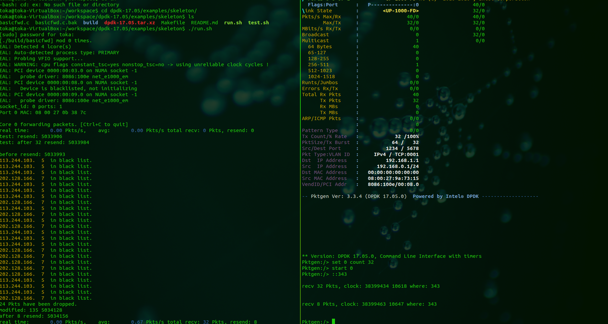

# dpdk-tool
demo

Traps:

0. How to install dpdk & pktgen? -- follow this [website](http://www.jianshu.com/p/dcb6ccc83ea5)
1. How to bind devs & reserve enough hugepages very quickly? -- use $DPDKDIR/usertools/dpdk-setup.sh
2. How to run pkt-gen instance only to send packets? -- see & run test.sh
3. How to run another user-defined instance using another port/lcore without conflicts? -- see & run run.sh


## Usage

1. install dpdk & this tool
```sh
cd YOURDIR
wget http://fast.dpdk.org/rel/dpdk-17.05.1.tar.xz
xz -d dpdk-17.05.1.tar.xz
tar -xvf dpdk-17.05.1.tar
cd dpdk-17.05.1/examples/skeleton
git init
git remote add origin https://github.com/Helicopt/dpdk-tool.git
mv basicfwd.c basicfwd.c.bak
git pull origin master
```
2. install pktgen
```sh
cd YOURDIR
git clone https://github.com/Helicopt/pktgen_for_expr.git

```
3. compile dpdk & this tool
```sh
cd YOURDIR
cd dpdk-17.05.1
export RTE_SDK=YOURDIR/dpdk-17.05.1
export RTE_TARGET=x86_64-native-linuxapp-gcc
make install T=x86_64-native-linuxapp-gcc
cd examples/skeleton
make
```
4. compile pktgen
```sh
cd YOURDIR
cd pktgen_for_expr
make
cd app
ln -s x86_64-native-linuxapp-gcc/pktgen pktgen
```
5. config
```
cd YOURDIR
cd dpdk-17.05.1
./usertools/dpdk-setup.sh
\[15\] load igb uio module
\[21\] bind devices (at least 2 devices)
\[18\] set hugepages: 2048
```
6. run

terminal1:
```sh
cd YOURDIR/dpdk-17.05.1/examples/skeleton
sh ./run.sh
```
terminal2:
```sh
cd YOURDIR/pktgen_for_expr
sh ./test.sh
```

7. expriment operation

pktgen:
```
set 0 count 32 *port 0 send 32 pkts per burst*
start 0 *start a burst*
```
skeleton - basicfwd:

Nothing but observe some info

## Effect


